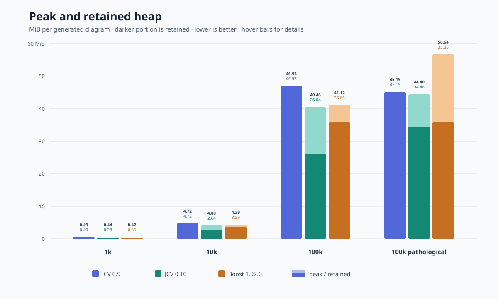
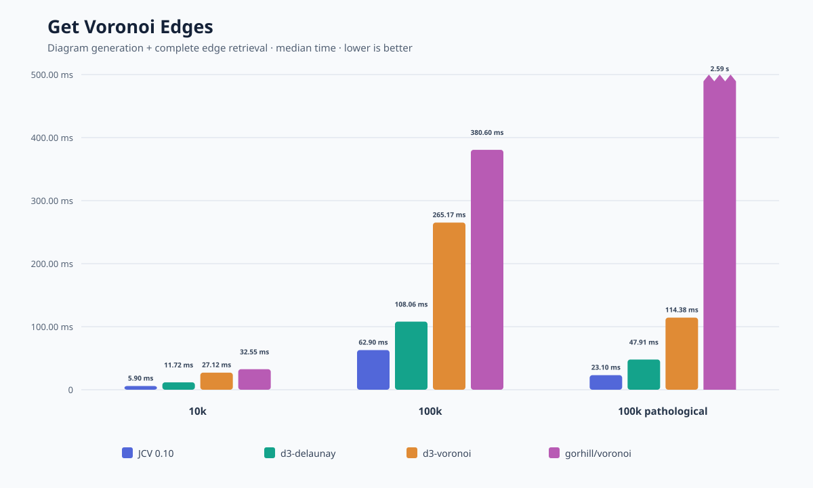
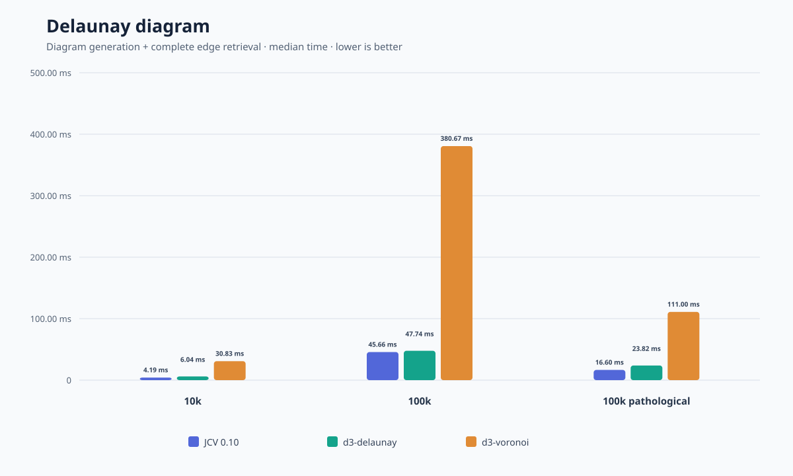
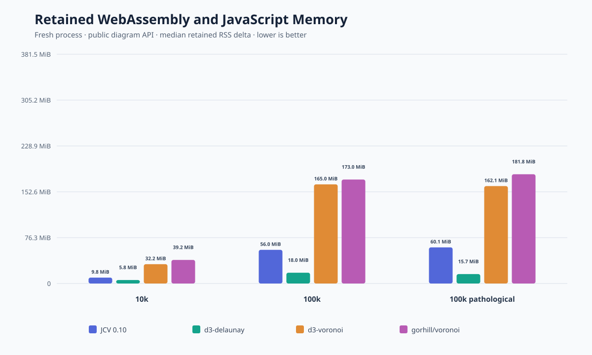
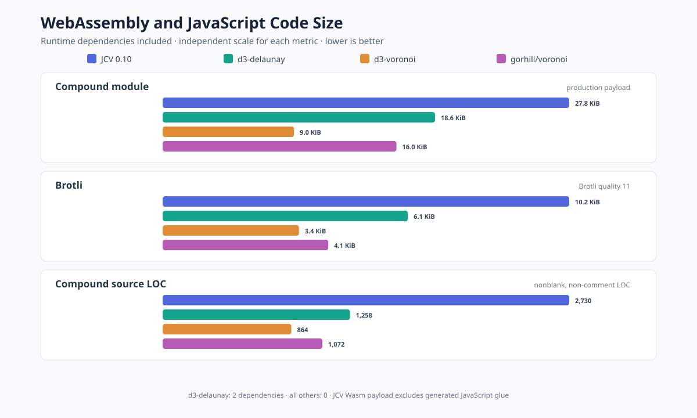

# Benchmarks

This performance test is running 1k, 10k and 100k random (same seed) point generation.
It also uses a special case of 100k points which really pushes the beachline operations.

*Tests ran on an Apple M5 Max MacBook Pro with 128 GB RAM, using Apple clang
21.0.0 with `-O3 -DNDEBUG` on arm64 macOS. The 0.10 timings are medians of five
benchmark-batch medians; each batch used 201 iterations for 1k, 51 for 10k,
and 31 for 100k and the pathological case. Boost used 21 iterations. 0.9 used
21 iterations for the smaller random cases and 5 for the pathological case,
where each run took about nine seconds. Input setup, image and output
generation, and output allocation were excluded from the timed region; diagram
destruction was included.*

## Graphs

Here is the resulting runtime performance:

And here is the peak memory useage, and what's retained once the diagram is generated:

Code metrics:

## Tables

### Diagram generation

| Case | 0.9 | 0.10 | Boost | 0.10/Boost |
|---|---:|---:|---:|---:|
| 10k | 5.04 ms | 4.87 ms | 6.82 ms | 71.5% |
| 100k | 51.22 ms | 53.95 ms | 80.21 ms | 67.3% |
| 100k pathological | 9.15 s | 18.63 ms | 39.25 ms | 47.5% |

### Memory

Each entry is peak heap KB / retained heap KB / allocation count.

| Case | 0.9 | 0.10 | Boost | 0.10/Boost |
|---|---:|---:|---:|---:|
| 10k | 4,832 / 4,832 / 281 | 4,181 / 2,699 / 126 | 4,394 / 3,672 / 55,815 | 95.2% |
| 100k | 48,060 / 48,060 / 2,785 | 41,434 / 26,666 / 1,187 | 42,104 / 36,719 / 557,371 | 98.4% |
| 100k pathological | 46,236 / 46,236 / 2,671 | 45,467 / 35,290 / 2,041 | 57,999 / 36,718 / 400,010 | 78.4% |

### Code and build statistics

| Metric | 0.9 | 0.10 | Boost | 0.10/Boost |
|---|---:|---:|---:|---:|
| Stripped executable | 33,912 B | 33,720 B | 150,616 B | 22.4% |
| Implementation code | 1,254 LOC | 1,961 LOC | 9,047 LOC | 21.7% |
| Clean build time | 0.13 s | 0.17 s | 0.97 s | 17.5% |

<!-- wasm-benchmarks:start -->
## WebAssembly and JavaScript Voronoi performance

Times are medians and lower is better. The benchmark exercises each library's public API. Point generation, comparison-library input conversion, WebAssembly initialization, garbage collection, and report generation are outside the timed regions. JCV's public `generate` call copies the prepared `Float32Array` into WebAssembly memory, and that copy is included.

The random cases use a deterministic seed. `100k pathological` is the issue48 input with 99,998 symmetric diagonal-pair sites. Each measurement has two untimed warmups followed by 10 samples for 10k and five samples for 100k and the pathological case.

JCV copies one packed result from WebAssembly into a JavaScript-owned `ArrayBuffer` and disposes each result inside the timed operation. Site access materializes ergonomic `Site` objects; edge rendering reads packed vertex arrays without creating edge objects. The Delaunay row instead uses JCV's adjacency-only generator and returns every edge as flat coordinates, without constructing a Voronoi diagram. Other libraries expose different public output forms: d3-voronoi and voronoi eagerly provide arrays, while d3-delaunay renders its Voronoi mesh. These rows therefore compare public access workflows, not identical post-processing algorithms.

### Voronoi Diagram Generation

| Case | JCV 0.10 | d3-delaunay | d3-voronoi | gorhill/voronoi |
|---|---:|---:|---:|---:|
| 10k | 7.76 ms | 3.12 ms | 29.06 ms | 34.58 ms |
| 100k | 98.21 ms | 31.54 ms | 342.88 ms | 335.06 ms |
| 100k pathological | 32.25 ms | 9.23 ms | 131.46 ms | 3.12 s |

### Generate + Get Sites

| Case | JCV 0.10 | d3-delaunay | d3-voronoi | gorhill/voronoi |
|---|---:|---:|---:|---:|
| 10k | 7.97 ms | 7.15 ms | 29.12 ms | 35.52 ms |
| 100k | 100.84 ms | 49.63 ms | 316.67 ms | 367.06 ms |
| 100k pathological | 35.00 ms | 27.16 ms | 114.78 ms | 2.54 s |

### Generate + Render Edges

| Case | JCV 0.10 | d3-delaunay | d3-voronoi | gorhill/voronoi |
|---|---:|---:|---:|---:|
| 10k | 8.52 ms | 11.47 ms | 29.06 ms | 33.92 ms |
| 100k | 112.98 ms | 126.28 ms | 326.02 ms | 367.44 ms |
| 100k pathological | 35.45 ms | 48.29 ms | 114.38 ms | 2.72 s |

### Generate + Get Delaunay

| Case | JCV 0.10 | d3-delaunay | d3-voronoi | gorhill/voronoi |
|---|---:|---:|---:|---:|
| 10k | 4.19 ms | 6.04 ms | 30.83 ms | — |
| 100k | 45.66 ms | 47.74 ms | 380.67 ms | — |
| 100k pathological | 16.60 ms | 23.82 ms | 111.00 ms | — |

### Peak and retained runtime memory

| Case | JCV 0.10 | d3-delaunay | d3-voronoi | gorhill/voronoi |
|---|---:|---:|---:|---:|
| 10k | 27.5 MiB / 22.2 MiB | 5.4 MiB / 5.4 MiB | 31.0 MiB / 31.0 MiB | 39.5 MiB / 39.5 MiB |
| 100k | 64.4 MiB / 32.8 MiB | 18.0 MiB / 18.0 MiB | 169.0 MiB / 164.5 MiB | 180.1 MiB / 174.0 MiB |
| 100k pathological | 72.4 MiB / 32.2 MiB | 16.0 MiB / 15.9 MiB | 166.3 MiB / 162.5 MiB | 186.8 MiB / 181.9 MiB |

Each entry is peak / retained RSS delta. Each sample starts a fresh Node.js process, prepares the library-specific input, forces garbage collection, records a baseline, generates and retains one public diagram, then forces garbage collection again. JCV uses the one-shot worker API; its worker terminates before the retained measurement. JCV peak RSS is sampled while the worker runs; comparison-library peak RSS uses the process high-water mark. Values are medians of 3 isolated samples. Input arrays and initialized runtimes are part of the baseline. RSS is runtime- and operating-system-dependent, so compare entries only within the environment reported below.

### Worker-backed JCV peak and retained memory

| Case | Tracked peak | Retained diagram | Observed peak RSS | Observed retained RSS |
|---|---:|---:|---:|---:|
| 10k | 17.3 MiB | 1.1 MiB | 27.5 MiB | 22.2 MiB |
| 100k | 50.9 MiB | 10.7 MiB | 64.4 MiB | 32.8 MiB |
| 100k pathological | 59.1 MiB | 9.4 MiB | 72.4 MiB | 32.2 MiB |

The tracked peak is the transferred input, the worker's WebAssembly linear memory, and the packed JavaScript result while all three coexist. Retained diagram memory is the exact packed buffer size after transfer and worker termination. RSS values are median process deltas from 3 isolated samples; allocators may keep released pages resident, so retained RSS can remain above the memory still owned by the API.

<!-- wasm-code-size:start -->
### Code size

| Library | Dependencies | Compound module | Brotli | Compound LOC |
|---|---:|---:|---:|---:|
| JCV 0.10 | 0 | 27.8 KiB | 10.2 KiB | 2,832 |
| d3-delaunay | 2 (delaunator, robust-predicates) | 18.6 KiB | 6.1 KiB | 1,258 |
| d3-voronoi | 0 | 9.0 KiB | 3.4 KiB | 864 |
| gorhill/voronoi | 0 | 16.0 KiB | 4.1 KiB | 1,072 |

Compound module size is the JCV `.wasm` payload or the library’s published minified browser module including runtime dependencies. Brotli uses quality 11. Compound LOC counts nonblank, non-comment implementation lines including runtime dependency sources. d3-delaunay depends directly on delaunator, which depends on robust-predicates; the other modules have no runtime package dependencies.

<!-- wasm-code-size:end -->

### Environment

- Apple M5 Max
- Darwin 27.0.0 (arm64)
- Node.js v26.5.0
- Wasm compiled with Emscripten `-O3 -flto`
- d3-delaunay 6.0.4, d3-voronoi 1.1.4, gorhill/voronoi 1.0.0

The `gorhill/voronoi` package has no direct Delaunay retrieval operation, so that entry is not applicable.

<!-- wasm-benchmarks:end -->
