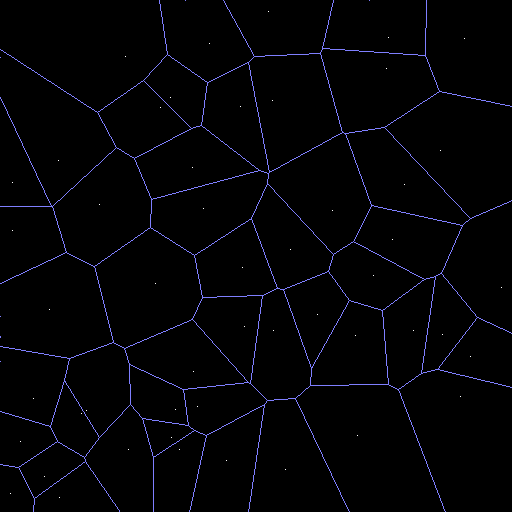

# voronoi
A fast C implementation for creating 2D Voronoi diagrams from a point set

Uses [Fortune's sweep algorithm.](https://en.wikipedia.org/wiki/Fortune%27s_algorithm)




Goals
=====

Given the alternative solutions out there, they usually lack one aspect or the other.
So this lib set out to achieve a combination of the good things the other libs provide.

* Easy to use
* Robustness
* Speed
* Small memory footprint
* Single/Double floating point implementation
* Readable code
* Small code (single source file)
* No external dependencies
* Cells have a list of edges (for easier/faster relaxation)
* Edges should be clipped
* A clear license

But mainly, I did it for fun :)

License
=======

[The MIT license](http://choosealicense.com/licenses/mit/)


Usage
=====

```C++

#define JC_VORONOI_IMPLEMENTATION
// If you wish to use doubles
//#define JCV_REAL_TYPE double
//#define JCV_FABS fabs
#include "jc_voronoi.h"

void draw_edges(const jcv_diagram& diagram);
void draw_cells(const jcv_diagram& diagram);

void generate_and_draw(int numpoints, const jcv_point* points, int imagewidth, int imageheight)
{
    jcv_diagram diagram = { 0 };
    jcv_diagram_generate(count, points, imagewidth, imageheight, &diagram );
    
    draw_edges(diagram);
    draw_cells(diagram);

    jcv_diagram_free( &diagram );
}

void draw_edges(const jcv_diagram& diagram)
{
    // If all you need are the edges
    const jcv_edge* edge = jcv_diagram_get_edges( &diagram );
    while( edge )
    {
        draw_line(edge->pos[0], edge->pos[1]);
        edge = edge->next;
    }
}

void draw_cells(const jcv_diagram& diagram)
{
    // If you want to draw triangles, or relax the diagram,
    // you can iterate over the sites and get all edges easily
    const jcv_site* sites = jcv_diagram_get_sites( &diagram );
    for( int i = 0; i < count; ++i )
    {
        const jcv_site& site = sites[i];

        const jcv_graphedge* e = site.edges;
        while( e )
        {
            draw_triangle( site.p, e->pos[0], e->pos[1]);
            e = e->next;
        }
    }
}

```


Comparisons
===========

| Feature vs Impl        | voronoi++ | boost | fastjet | jcv |
|-----------------------:|-----------|-------|---------|-----|
| Edge clip              |     *     |       |    *    |  *  |
| Generate Edges         |     *     |   *   |    *    |  *  |
| Generate Cells         |     *     |   *   |         |  *  |
| Cell Edges Not Flipped |           |   *   |         |  *  |
| Cell Edges CCW         |           |   *   |         |  *  |
| Cell Edges Covers Area |           |       |         |  *  |


General thoughts
================

O'Sullivan
----------

A C++ version of the original C version from Steven Fortune.

Although fast, it's not completely robust and will produce errors.


Fastjet
-------

The Fastjet version is built upon Steven Fortune's original C version, which Shane O'Sullivan improved upon. 
Given the robustness and speed improvements of the implementation done by Fastjet,
that should be the base line to compare other implementations with.

Unfortunately, the code is not very readable, and the license is unclear (GPL?)


Boost
-----

Using boost might be convenient for some, but the sheer amount of code is too great in many cases.
I had to install 5 modules of boost to compile (config, core, mpl, preprocessor and polygon).

It is ~2x as slow as the fastest algorithms, and takes ~2.5x as much memory.

The code consists of only templated headers, and it increases compile time a lot.
For simply generating a 2D voronoi diagram using points as input, it is clearly overkill.

The boost implementation also puts the burden of clipping the final edges on the client.


Voronoi++
---------

The speed of it is simply too slow (~22x) to be used in a time critical application.
And it uses ~3x more memory than the fastest algorithms.

Using the same data sets as the other algorithms, it breaks under some conditions.

Ivan K
------

Even though I started out using this, after reading a nice blog post about it,
it turns out to be among the slowest but more importantly, it is broken.
It simply doesn't handle many of the edge cases. For instance,
it cannot handle vertical edges due to the fact that it represents lines as 'y = mx + b'


Contact
=======

http://sizeofvoid.blogspot.com

https://twitter.com/mwesterdahl76
