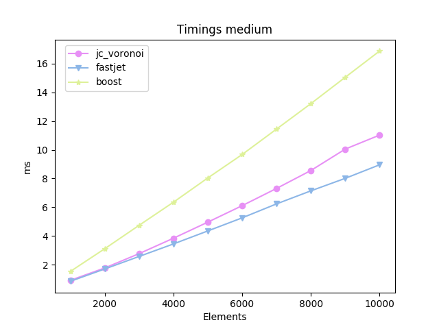
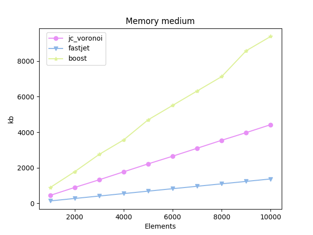

|Branch      |OSX/Linux |Windows   |
|------------|----------|----------|
|master      | [](https://travis-ci.org/JCash/voronoi?branch=master) | [](https://ci.appveyor.com/project/JCash/voronoi/branch/master) |
|dev         | [](https://travis-ci.org/JCash/voronoi?branch=dev) | [](https://ci.appveyor.com/project/JCash/voronoi/branch/dev) |


# jc_voronoi
A fast C/C++ header only implementation for creating 2D Voronoi diagrams from a point set

Uses [Fortune's sweep algorithm.](https://en.wikipedia.org/wiki/Fortune%27s_algorithm)


# Brief

I was realizing that the previous 2D voronoi generator I was using, was taking up too much time in my app,
and worse, sometimes it also produced errors.

So I started looking for other implementations.

Given the alternatives out there, they usually lack one aspect or the other.
So this project set out to achieve a combination of the good things the other libs provide.

* Easy to use
* Robustness
* Speed
* Small memory footprint
* Single/Double floating point implementation
* Readable code
* Small code (single source file)
* No external dependencies
* Cells have a list of edges (for easier/faster relaxation)
* Edges should be clipped
* A clear license

But mostly, I did it for fun :)

# Disclaimer

This software is supplied "AS IS" without any warranties and support

# License

[The MIT license](http://choosealicense.com/licenses/mit/)

# Feature comparisons

| Feature vs Impl        | voronoi++ | boost | fastjet | jcv |
|-----------------------:|-----------|-------|---------|-----|
| Edge clip              |     *     |       |    *    |  *  |
| Generate Edges         |     *     |   *   |    *    |  *  |
| Generate Cells         |     *     |   *   |         |  *  |
| Cell Edges Not Flipped |           |   *   |         |  *  |
| Cell Edges CCW         |           |   *   |         |  *  |
| Easy Relaxation        |           |       |         |  *  |
| Custom Allocator       |           |       |         |  *  |


# Some Numbers

*Tests run on a Intel(R) Core(TM) i7-7567U CPU @ 3.50GHz MBP with 16 GB 2133 MHz LPDDR3 ram. Each test ran 20 times, and the average time is presented below*

*I removed the voronoi++ from the results, since they were consistently 10x-15x slower than the rest and consumed way more memory*
_
<br/>


_
<br/>


_
<br/>


Same stats, as tables

## Timings medium

| counts | jc_voronoi | fastjet   | boost      |
|-------:|------------|-----------|------------|
| 1000   | 0.9119 ms  | 0.8439 ms | 1.5290 ms  | 
| 2000   | 1.7700 ms  | 1.7010 ms | 3.1100 ms  | 
| 3000   | 2.7680 ms  | 2.5730 ms | 4.7400 ms  | 
| 4000   | 3.8420 ms  | 3.4450 ms | 6.3510 ms  | 
| 5000   | 4.9620 ms  | 4.3500 ms | 8.0390 ms  | 
| 6000   | 6.1100 ms  | 5.2610 ms | 9.6720 ms  | 
| 7000   | 7.3090 ms  | 6.2330 ms | 11.4420 ms | 
| 8000   | 8.5580 ms  | 7.1420 ms | 13.2150 ms | 
| 9000   | 10.0490 ms | 8.0130 ms | 15.0490 ms | 
| 10000  | 11.0250 ms | 8.9560 ms | 16.8780 ms | 


## Memory medium

| counts | jc_voronoi | fastjet | boost   |
|-------:|------------|---------|---------|
| 1000   | 447 kb     | 137 kb  | 888 kb  | 
| 2000   | 894 kb     | 275 kb  | 1779 kb | 
| 3000   | 1325 kb    | 412 kb  | 2751 kb | 
| 4000   | 1773 kb    | 549 kb  | 3567 kb | 
| 5000   | 2220 kb    | 687 kb  | 4698 kb | 
| 6000   | 2651 kb    | 824 kb  | 5508 kb | 
| 7000   | 3098 kb    | 961 kb  | 6318 kb | 
| 8000   | 3546 kb    | 1098 kb | 7125 kb | 
| 9000   | 3977 kb    | 1235 kb | 8578 kb | 
| 10000  | 4424 kb    | 1372 kb | 9383 kb | 


# Usage

The api contains these functions

```C
void jcv_diagram_generate( int num_points, const jcv_point* points, const jcv_rect* rect, jcv_diagram* diagram );
void jcv_diagram_generate_useralloc( int num_points, const jcv_point* points, const jcv_rect* rect, void* userallocctx, FJCVAllocFn allocfn, FJCVFreeFn freefn, jcv_diagram* diagram );
void jcv_diagram_free( jcv_diagram* diagram );

const jcv_site* jcv_diagram_get_sites( const jcv_diagram* diagram );
const jcv_edge* jcv_diagram_get_edges( const jcv_diagram* diagram );
```

The input points are pruned if

    * There are duplicates points
    * The input points are outside of the bounding box

The input bounding box is optional

## Example
Example implementation (see main.c for actual code)
```C

#define JC_VORONOI_IMPLEMENTATION
// If you wish to use doubles
//#define JCV_REAL_TYPE double
//#define JCV_FABS fabs
//#define JCV_ATAN2 atan2
#include "jc_voronoi.h"

void draw_edges(const jcv_diagram* diagram);
void draw_cells(const jcv_diagram* diagram);

void generate_and_draw(int numpoints, const jcv_point* points, int imagewidth, int imageheight)
{
    jcv_diagram diagram;
    memset(&diagram, 0, sizeof(jcv_diagram));
    jcv_diagram_generate(count, points, 0, &diagram );

    draw_edges(diagram);
    draw_cells(diagram);

    jcv_diagram_free( &diagram );
}

void draw_edges(const jcv_diagram* diagram)
{
    // If all you need are the edges
    const jcv_edge* edge = jcv_diagram_get_edges( diagram );
    while( edge )
    {
        draw_line(edge->pos[0], edge->pos[1]);
        edge = edge->next;
    }
}

void draw_cells(const jcv_diagram* diagram)
{
    // If you want to draw triangles, or relax the diagram,
    // you can iterate over the sites and get all edges easily
    const jcv_site* sites = jcv_diagram_get_sites( diagram );
    for( int i = 0; i < diagram->numsites; ++i )
    {
        const jcv_site* site = &sites[i];

        const jcv_graphedge* e = site->edges;
        while( e )
        {
            draw_triangle( site->p, e->pos[0], e->pos[1]);
            e = e->next;
        }
    }
}

// Here is a simple example of how to do the relaxations of the cells
void relax_points(const jcv_diagram* diagram, jcv_point* points)
{
    const jcv_site* sites = jcv_diagram_get_sites(diagram);
    for( int i = 0; i < diagram->numsites; ++i )
    {
        const jcv_site* site = &sites[i];
        jcv_point sum = site->p;
        int count = 1;

        const jcv_graphedge* edge = site->edges;

        while( edge )
        {
            sum.x += edge->pos[0].x;
            sum.y += edge->pos[0].y;
            ++count;
            edge = edge->next;
        }

        points[site->index].x = sum.x / count;
        points[site->index].y = sum.y / count;
    }
}

```


# General thoughts

## Fastjet

The Fastjet version is built upon Steven Fortune's original C version, which Shane O'Sullivan improved upon. 
Given the robustness and speed improvements of the implementation done by Fastjet,
that should be the base line to compare other implementations with.

Unfortunately, the code is not very readable, and the license is unclear (GPL?)

Also, if you want access to the actual cells, you have to recreate that yourself using the edges.


## Boost

Using boost might be convenient for some, but the sheer amount of code is too great in many cases.
I had to install 5 modules of boost to compile (config, core, mpl, preprocessor and polygon).
If you install full boost, that's 650mb of source.

It is ~2x as slow as the fastest algorithms, and takes ~2.5x as much memory.

The boost implementation also puts the burden of clipping the final edges on the client.

The code consists of only templated headers, and it increases compile time a *lot*.
For simply generating a 2D voronoi diagram using points as input, it is clearly overkill.


## Voronoi++

The performance of it is very slow (~20x slower than fastjet) and 
And it uses ~2.5x-3x more memory than the fastest algorithms.

Using the same data sets as the other algorithms, it breaks under some conditions.


## O'Sullivan

A C++ version of the original C version from Steven Fortune.

Although fast, it's not completely robust and will produce errors.
