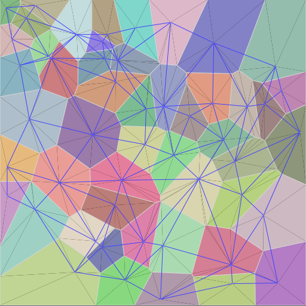
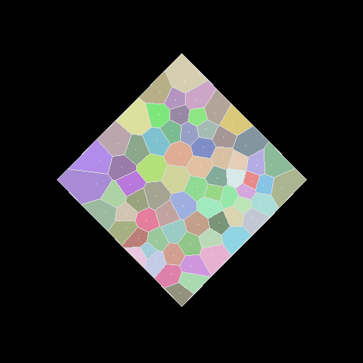
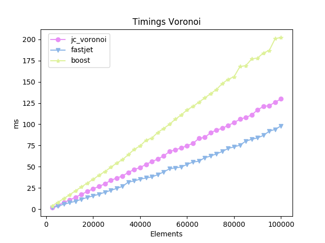
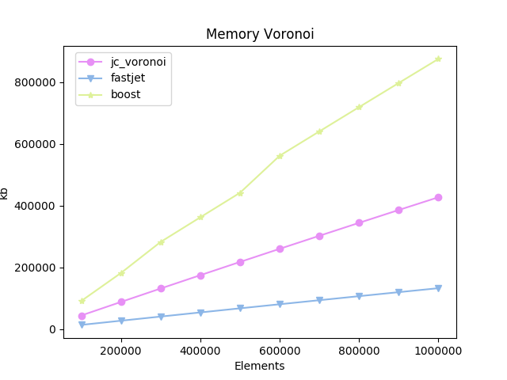
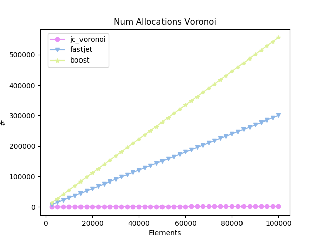

|Branch      | macOS/Linux/Windows |
|------------|---------------------|
|master      | [](https://github.com/JCash/voronoi/actions/workflows/build.yml) |
|dev         | [](https://github.com/JCash/voronoi/actions/workflows/build.yml) |


# jc_voronoi
A fast C header only implementation for creating 2D Voronoi diagrams from a point set

 

* Uses [Fortune's sweep algorithm.](https://en.wikipedia.org/wiki/Fortune%27s_algorithm)
* Disclaimer: This software is supplied "AS IS" without any warranties and support
* [LICENSE](./LICENSE) ([The MIT license](http://choosealicense.com/licenses/mit/))
* [Showcases](./SHOWCASES.md)

# Brief

I was realizing that the previous 2D voronoi generator I was using, was taking up too much time in my app,
and worse, sometimes it also produced errors.

So I started looking for other implementations.

Given the alternatives out there, they usually lack one aspect or the other.
So this project set out to achieve a combination of the good things the other libs provide.

* Easy to use
* Robustness
* Speed
* Small memory footprint
* Single/Double floating point implementation
* Readable code
* Small code (single source file)
* No external dependencies
* Cells have a list of edges (for easier/faster relaxation)
* Edges should be clipped
* A clear license

But mostly, I did it for fun :)

# Feature comparisons

| Feature vs Impl        | voronoi++ | boost | fastjet | d3-delaunay | jcv |
|-----------------------:|-----------|-------|---------|-------------|-----|
| Language               |    C++    |  C++  |    C    | JavaScript  |  C  |
| Edge clip              |     *     |       |    *    |      *      |  *  |
| Generate Edges         |     *     |   *   |    *    |      *      |  *  |
| Generate Cells         |     *     |   *   |         |      *      |  *  |
| Cell Edges Not Flipped |           |   *   |         |             |  *  |
| Cell Edges CCW         |           |   *   |         |             |  *  |
| Easy Relaxation        |           |       |         |      *      |  *  |
| Custom Allocator       |           |       |         |             |  *  |
| Delauney generation    |           |       |         |      *      |  *  |

# Build

`jc_voronoi` is a header-only library, so you do not need to build the library
itself. The repository also includes `src/main.c`, an example app that generates
a Voronoi diagram and writes it to a PNG or SVG file. Run the commands below
from the repository root to build and run that app.

## Supported C dialects

The source supports C99 and later: C99, C11, C17, and C23. On compilers that
use the pre-standard name for C23, select `c2x`. The header can also be included
from C++.

## Using the library

Add `src/jc_voronoi.h` to your project and emit its implementation from exactly
one C or C++ translation unit:

```C
#define JC_VORONOI_IMPLEMENTATION
#include "jc_voronoi.h"
```

Other translation units should include `jc_voronoi.h` without defining
`JC_VORONOI_IMPLEMENTATION`.

## macOS

Build and run the example (assumes `clang` is installed):

```sh
./scripts/compile.sh
./build/main -n 100 -r 3 -w 1024 -h 768 -o example.svg
```

## Linux

Build and run the example (assumes `clang` is installed):

```sh
./scripts/compile.sh
./build/main -n 100 -r 3 -w 1024 -h 768 -o example.svg
```

## Windows

Install Visual Studio or the Visual Studio Build Tools with the **Desktop
development with C++** workload. From an **x64 Native Tools Command Prompt for
VS**, run:

```bat
scripts\compile_cl.bat
build\main.exe -n 100 -r 3 -w 1024 -h 768 -o example.svg
```

The example above generates 100 random sites, applies three relaxation passes,
and writes a 1024 x 768 `example.svg` in the current directory. Run
`build/main --help` on macOS/Linux or
`build\main.exe --help` on Windows to see all options, including image size,
relaxation, input files, and SVG output.

## WebAssembly

Version tags automatically publish a browser-ready WebAssembly package on the
[GitHub Releases page](https://github.com/JCash/voronoi/releases). The package
contains `jc_voronoi.wasm`, Emscripten's ES-module loader, and a small
`voronoi.js` wrapper for browsers and Node.js. You can also try the
[interactive WebAssembly demo](https://jcash.github.io/voronoi/), which is
rebuilt from the `dev` branch.

```js
import { loadVoronoi } from "./voronoi.js";

const voronoi = await loadVoronoi();
const edges = voronoi.edges(
  [{ x: 10, y: 20 }, { x: 80, y: 30 }, { x: 40, y: 90 }],
  100,
  100,
);
// Float32Array: x0, y0, x1, y1 for each edge
```

To build the package locally, install the Emscripten SDK and run
`./scripts/build_wasm.sh`. The output is written to `build/wasm` by default.

To run the interactive example locally:

```sh
./scripts/build_wasm.sh site/vendor
npm ci --prefix benchmark
npm run build --prefix benchmark
python3 -m http.server 8000 --directory site
```

Open `http://localhost:8000/` for the example.

To regenerate the offline performance report and its `wasm-*.svg` charts:

```sh
./scripts/build_wasm.sh
npm ci --prefix benchmark
npm run benchmark --prefix benchmark
```

See [Benchmarks.md](Benchmarks.md) for the generated tables, methodology, and
charts. The benchmark compares diagram generation, generation plus site
access, generation plus Voronoi-edge access, and generation plus Delauney-edge access for
the 10k, 100k, and 100k pathological (issue48) inputs. It also generates module-size, Brotli, and
source-LOC comparisons. To update only those code-size results, run
`npm run code-size --prefix benchmark`.

<details>
<summary>Configuration defines</summary>

Define configuration macros before including `jc_voronoi.h`. Use the same
configuration in every translation unit that includes the header.

| Define | Purpose | Default |
|--------|---------|---------|
| `JC_VORONOI_IMPLEMENTATION` | Emits the implementation; define it in exactly one translation unit | Not defined |
| `JCV_REAL_TYPE` | Scalar type used for coordinates and calculations | `float` |
| `JCV_REAL_TYPE_EPSILON` | Epsilon used when comparing scalar values | `FLT_EPSILON` |
| `JCV_ATAN2` | Two-argument arctangent function matching `JCV_REAL_TYPE` | `atan2f` |
| `JCV_SQRT` | Square-root function matching `JCV_REAL_TYPE` | `sqrtf` |
| `JCV_PI` | Pi constant matching `JCV_REAL_TYPE` | Single-precision pi |
| `JCV_FLT_MAX` | Largest supported coordinate magnitude | `FLT_MAX` equivalent |
| `JC_VORONOI_CLIP_IMPLEMENTATION` | Emits the optional `jc_voronoi_clip.h` implementation | Not defined |

### Double floating point precision

For double-precision coordinates and calculations, override the scalar type,
math functions, limits, and constants before including the header:

```C
#define JCV_REAL_TYPE double
#define JCV_REAL_TYPE_EPSILON DBL_EPSILON
#define JCV_ATAN2 atan2
#define JCV_SQRT sqrt
#define JCV_FLT_MAX DBL_MAX
#define JCV_PI 3.14159265358979323846264338327950288
#define JC_VORONOI_IMPLEMENTATION
#include "jc_voronoi.h"
```

</details>

# Usage

* [Migration guide](./MIGRATION_GUIDE.md)

## Api

The main api contains these functions

```C
void jcv_diagram_generate( int num_points, const jcv_point* points, const jcv_rect* rect, const jcv_clipper* clipper, jcv_diagram* diagram );
void jcv_delauney_generate( int num_points, const jcv_point* points, const jcv_rect* rect, const jcv_clipper* clipper, jcv_diagram* diagram );
void jcv_diagram_generate_useralloc( int num_points, const jcv_point* points, const jcv_rect* rect, const jcv_clipper* clipper, void* userallocctx, FJCVAllocFn allocfn, FJCVFreeFn freefn, jcv_diagram* diagram );
void jcv_diagram_free( jcv_diagram* diagram );

const jcv_site* jcv_diagram_get_sites( const jcv_diagram* diagram );
int jcv_get_num_vertices( const jcv_diagram* diagram );
void jcv_diagram_get_vertices( const jcv_diagram* diagram, jcv_point* vertices );
int jcv_diagram_get_edge_count( const jcv_diagram* diagram );
int jcv_delauney_get_edge_count( const jcv_diagram* diagram );
void jcv_diagram_get_edges( const jcv_diagram* diagram, jcv_edge_iter* iter );
void jcv_site_get_edges( const jcv_diagram* diagram, const jcv_site* site, jcv_edge_iter* iter );
int jcv_edge_next( jcv_edge_iter* iter, jcv_edge* edge );
```

## Generate a diagram

Create a zero-initialized diagram, generate it from an array of points, iterate
through its sites and their edges, then free it when you are done:

```C
jcv_point points[] = {
    { 0, 0 },
    { 100, 0 },
    { 50, 100 }
};

jcv_diagram diagram = {0};
jcv_diagram_generate(3, points, NULL, NULL, &diagram);

const jcv_site* sites = jcv_diagram_get_sites(&diagram);
for( int i = 0; i < diagram.numsites; ++i )
{
    const jcv_site* site = &sites[i];

    jcv_edge_iter iter;
    jcv_edge edge;
    jcv_site_get_edges(&diagram, site, &iter);
    while( jcv_edge_next(&iter, &edge) )
    {
        // Use site and edge here.
    }
}

jcv_diagram_free(&diagram);
```

Passing `NULL` for the bounding rectangle calculates one automatically. Passing
`NULL` for the clipper uses the default box clipper.

The input points are pruned if

* There are duplicates points
* The input points are outside of the bounding box
* The input points are rejected by the clipper's test function

The input bounding box is optional

The input clipper is optional, a default box clipper is used by default

<details>
<summary>Accessing sites in input order</summary>

The sites returned by `jcv_diagram_get_sites` are sorted for Fortune's sweep
algorithm and are not in the same order as the input points. Each site's
`index` is the index of its original input point. To access sites by that
index, create a reverse lookup after generating the diagram:

```C
const jcv_site* sites = jcv_diagram_get_sites(&diagram);
const jcv_site** sites_by_input = calloc(
    (size_t)num_points, sizeof(*sites_by_input));

for( int i = 0; i < diagram.numsites; ++i )
    sites_by_input[sites[i].index] = &sites[i];

const jcv_site* site = sites_by_input[input_index];
```

Allocate the lookup for the original number of input points, rather than
`diagram.numsites`. An entry can be `NULL` when the corresponding input point
was pruned because it was a duplicate, outside the bounding box, or rejected
by the clipper. The site pointers remain valid until `jcv_diagram_free` is
called. Free `sites_by_input` when it is no longer needed.

Both edge functions initialize a `jcv_edge_iter`; `jcv_edge_next` then fills a
caller-owned `jcv_edge` and performs no allocation. Diagram iteration returns
each edge once. Site iteration returns the site's edges in counter-clockwise
order, with `edge.sites[0]` set to that site and the endpoints oriented around
the cell.

</details>

<details>
<summary>Delauney triangulation</summary>

If only Delauney adjacency is needed, generate it without clipping or building
Voronoi cell topology:
(See [main.c](./src/main.c) for a practical example)

```C
jcv_diagram diagram = {0};
jcv_delauney_generate(num_points, points, NULL, NULL, &diagram);
int edge_count = jcv_delauney_get_edge_count(&diagram);

jcv_delauney_iter iter;
jcv_delauney_begin( &diagram, &iter );
jcv_delauney_edge delauney_edge;
while (jcv_delauney_next( &iter, &delauney_edge ))
{
    ...
}

jcv_diagram_free(&diagram);
```

Sites and the Delauney iterator are available on a Delauney-only diagram. Only
the `sites` and `pos` members of each `jcv_delauney_edge` are valid. Voronoi edge
geometry, per-site edges, and unique vertices are intentionally unavailable.

</details>

<details>
<summary>Unique vertices</summary>

Each edge endpoint has a contiguous integer vertex index. The diagram itself
does not allocate a separate vertex array; clients can create one only when it
is needed, without comparing floating-point coordinates:

```C
jcv_point* vertices = malloc((size_t)jcv_get_num_vertices(&diagram) * sizeof(*vertices));
jcv_diagram_get_vertices(&diagram, vertices);

jcv_edge_iter iter;
jcv_edge edge;
jcv_diagram_get_edges(&diagram, &iter);
while (jcv_edge_next(&iter, &edge))
{
    add_indexed_edge(edge.vertices[0], edge.vertices[1]);
}
```

To build a mapping from each vertex to its connected sites, iterate over each
site's edges and link the first endpoint. Since the edges form an ordered,
closed loop, this visits each vertex of the site exactly once:

```C
int num_vertices = jcv_get_num_vertices(&diagram);
allocate_vertex_site_storage(num_vertices);

const jcv_site* sites = jcv_diagram_get_sites(&diagram);
for( int i = 0; i < diagram.numsites; ++i )
{
    const jcv_site* site = &sites[i];
    jcv_edge_iter iter;
    jcv_edge edge;

    jcv_site_get_edges(&diagram, site, &iter);
    while( jcv_edge_next(&iter, &edge) )
        link_vertex_site(edge.vertices[0], site);
}
```

Here, `allocate_vertex_site_storage` and `link_vertex_site` are client-defined.

</details>

<details>
<summary>Relaxing the points</summary>

Here is an example of how to do the relaxations of the cells.

```C
void relax_points(const jcv_diagram* diagram, jcv_point* points)
{
    const jcv_site* sites = jcv_diagram_get_sites(diagram);
    for( int i = 0; i < diagram->numsites; ++i )
    {
        const jcv_site* site = &sites[i];
        jcv_point sum = site->p;
        int count = 1;

        jcv_edge_iter iter;
        jcv_edge edge;
        jcv_site_get_edges(diagram, site, &iter);
        while( jcv_edge_next(&iter, &edge) )
        {
            sum.x += edge.pos[0].x;
            sum.y += edge.pos[0].y;
            ++count;
        }

        points[site->index].x = sum.x / count;
        points[site->index].y = sum.y / count;
    }
}
```

</details>

<details>
<summary>Custom clipping</summary>

The library also comes with a second header, that contains code for custom clipping of edges against a convex polygon.

The polygon is defined by a set of

Again, see [main.c](./src/main.c) for a practical example

```C

    #define JC_VORONOI_CLIP_IMPLEMENTATION
    #include "jc_voronoi_clip.h"

    jcv_clipping_polygon polygon;
    // Triangle
    polygon.num_points = 3;
    polygon.points = (jcv_point*)malloc(sizeof(jcv_point)*(size_t)polygon.num_points);

    polygon.points[0].x = width/2;
    polygon.points[1].x = width - width/5;
    polygon.points[2].x = width/5;
    polygon.points[0].y = height/5;
    polygon.points[1].y = height - height/5;
    polygon.points[2].y = height - height/5;

    jcv_clipper polygonclipper;
    polygonclipper.test_fn = jcv_clip_polygon_test_point;
    polygonclipper.clip_fn = jcv_clip_polygon_clip_edge;
    polygonclipper.fill_fn = jcv_clip_polygon_fill_gaps;
    polygonclipper.ctx = &polygon;

    jcv_diagram diagram;
    memset(&diagram, 0, sizeof(jcv_diagram));
    jcv_diagram_generate(count, (const jcv_point*)points, 0, clipper, &diagram);
```

</details>

<details>
<summary>Example</summary>

Example implementation (see [main.c](./src/main.c) for actual code):

```C
#define JC_VORONOI_IMPLEMENTATION
#include "jc_voronoi.h"

void draw_edges(const jcv_diagram* diagram);
void draw_cells(const jcv_diagram* diagram);
void draw_delauney(const jcv_diagram* diagram);

void generate_and_draw(int numpoints, const jcv_point* points, int imagewidth, int imageheight)
{
    jcv_diagram diagram;
    memset(&diagram, 0, sizeof(jcv_diagram));
    jcv_diagram_generate(numpoints, points, 0, 0, &diagram);

    draw_edges(&diagram);
    draw_cells(&diagram);
    draw_delauney(&diagram);

    jcv_diagram_free(&diagram);
}

void draw_edges(const jcv_diagram* diagram)
{
    // If all you need are the edges
    jcv_edge_iter iter;
    jcv_edge edge;
    jcv_diagram_get_edges(diagram, &iter);
    while( jcv_edge_next(&iter, &edge) )
    {
        draw_line(edge.pos[0], edge.pos[1]);
    }
}

void draw_cells(const jcv_diagram* diagram)
{
    // If you want to draw triangles, or relax the diagram,
    // you can iterate over the sites and get all edges easily
    const jcv_site* sites = jcv_diagram_get_sites(diagram);
    for( int i = 0; i < diagram->numsites; ++i )
    {
        const jcv_site* site = &sites[i];

        jcv_edge_iter iter;
        jcv_edge edge;
        jcv_site_get_edges(diagram, site, &iter);
        while( jcv_edge_next(&iter, &edge) )
        {
            draw_triangle(site->p, edge.pos[0], edge.pos[1]);
        }
    }
}

void draw_delauney(const jcv_diagram* diagram)
{
    jcv_delauney_iter delauney;
    jcv_delauney_begin(diagram, &delauney);
    jcv_delauney_edge delauney_edge;
    while( jcv_delauney_next(&delauney, &delauney_edge) )
    {
        draw_line(delauney_edge.pos[0], delauney_edge.pos[1]);
    }
}
```

</details>

# Some Numbers

*Tests run on a Intel(R) Core(TM) i7-7567U CPU @ 3.50GHz MBP with 16 GB 2133 MHz LPDDR3 ram. Each test ran 20 times, and the minimum time is presented below*

*I removed the voronoi++ from the results, since it was consistently 10x-15x slower than the rest and consumed way more memory*
_
<br/>




[Same stats, as tables](./test/report.md)


# General thoughts

## Fastjet

The Fastjet version is built upon Steven Fortune's original C version, which Shane O'Sullivan improved upon.
Given the robustness and speed improvements of the implementation done by Fastjet,
that should be the base line to compare other implementations with.

Unfortunately, the code is not very readable, and the license is unclear (GPL?)

Also, if you want access to the actual cells, you have to recreate that yourself using the edges.


## Boost

Using boost might be convenient for some, but the sheer amount of code is too great in many cases.
I had to install 5 modules of boost to compile (config, core, mpl, preprocessor and polygon).
If you install full boost, that's 650mb of source.

It is ~2x as slow as the fastest algorithms, and takes ~2.5x as much memory.

The boost implementation also puts the burden of clipping the final edges on the client.

The code consists of only templated headers, and it increases compile time a *lot*.
For simply generating a 2D voronoi diagram using points as input, it is clearly overkill.


## Voronoi++

The performance of it is very slow (~20x slower than fastjet) and
And it uses ~2.5x-3x more memory than the fastest algorithms.

Using the same data sets as the other algorithms, it breaks under some conditions.


## O'Sullivan

A C++ version of the original C version from Steven Fortune.

Although fast, it's not completely robust and will produce errors.


# Gallery

I'd love to see what you're using this software for!
If possible, please send me images and some brief explanation of your usage of this library!
