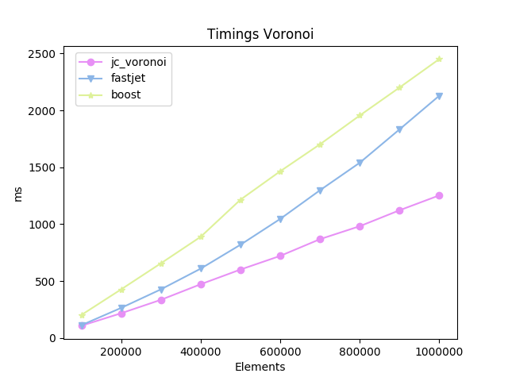
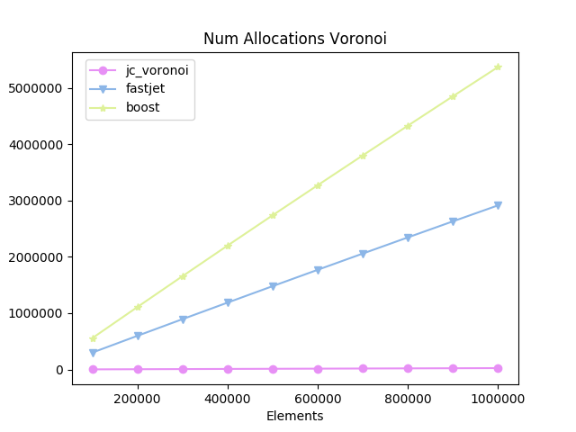

|Branch      | macOS/Linux/Windows |
|------------|---------------------|
|master      | [](https://github.com/JCash/voronoi/actions/workflows/build.yml) |
|dev         | [](https://github.com/JCash/voronoi/actions/workflows/build.yml) |


# jc_voronoi
A fast C/C++ header only implementation for creating 2D Voronoi diagrams from a point set

Uses [Fortune's sweep algorithm.](https://en.wikipedia.org/wiki/Fortune%27s_algorithm)

 

# Brief

I was realizing that the previous 2D voronoi generator I was using, was taking up too much time in my app,
and worse, sometimes it also produced errors.

So I started looking for other implementations.

Given the alternatives out there, they usually lack one aspect or the other.
So this project set out to achieve a combination of the good things the other libs provide.

* Easy to use
* Robustness
* Speed
* Small memory footprint
* Single/Double floating point implementation
* Readable code
* Small code (single source file)
* No external dependencies
* Cells have a list of edges (for easier/faster relaxation)
* Edges should be clipped
* A clear license

But mostly, I did it for fun :)

# Disclaimer

This software is supplied "AS IS" without any warranties and support

# License

[LICENSE](./LICENSE) ([The MIT license](http://choosealicense.com/licenses/mit/))

# Feature comparisons

| Feature vs Impl        | voronoi++ | boost | fastjet | jcv |
|-----------------------:|-----------|-------|---------|-----|
| Language               |    C++    |  C++  |    C    |  C  |
| Edge clip              |     *     |       |    *    |  *  |
| Generate Edges         |     *     |   *   |    *    |  *  |
| Generate Cells         |     *     |   *   |         |  *  |
| Cell Edges Not Flipped |           |   *   |         |  *  |
| Cell Edges CCW         |           |   *   |         |  *  |
| Easy Relaxation        |           |       |         |  *  |
| Custom Allocator       |           |       |         |  *  |
| Delauney generation    |           |       |         |  *  |

# Usage

The main api contains these functions

```C
void jcv_diagram_generate( int num_points, const jcv_point* points, const jcv_rect* rect, const jcv_clipper* clipper, jcv_diagram* diagram );
void jcv_diagram_generate_useralloc( int num_points, const jcv_point* points, const jcv_rect* rect, const jcv_clipper* clipper, void* userallocctx, FJCVAllocFn allocfn, FJCVFreeFn freefn, jcv_diagram* diagram );
void jcv_diagram_free( jcv_diagram* diagram );

const jcv_site* jcv_diagram_get_sites( const jcv_diagram* diagram );
const jcv_edge* jcv_diagram_get_edges( const jcv_diagram* diagram );
const jcv_edge* jcv_diagram_get_next_edge( const jcv_edge* edge );
```

The input points are pruned if

* There are duplicates points
* The input points are outside of the bounding box
* The input points are rejected by the clipper's test function

The input bounding box is optional

The input clipper is optional, a default box clipper is used by default

## Delauney triangulation

After generating the Voronoi diagram, you can iterate over the Delauney edges like so:
(See [main.c](./src/main.c) for a practical example)

```C
jcv_delauney_iter iter;
jcv_delauney_begin( &diagram, &iter );
jcv_delauney_edge delauney_edge;
while (jcv_delauney_next( &iter, &delauney_edge ))
{
    ...
}
```

## Example
Example implementation (see [main.c](./src/main.c) for actual code)
```C

#define JC_VORONOI_IMPLEMENTATION
#include "jc_voronoi.h"

void draw_edges(const jcv_diagram* diagram);
void draw_cells(const jcv_diagram* diagram);
void draw_delauney(const jcv_diagram* diagram);

void generate_and_draw(int numpoints, const jcv_point* points, int imagewidth, int imageheight)
{
    jcv_diagram diagram;
    memset(&diagram, 0, sizeof(jcv_diagram));
    jcv_diagram_generate(count, points, 0, 0, &diagram );

    draw_edges(&diagram);
    draw_cells(&diagram);
    draw_delauney(&diagram);

    jcv_diagram_free( &diagram );
}

void draw_edges(const jcv_diagram* diagram)
{
    // If all you need are the edges
    const jcv_edge* edge = jcv_diagram_get_edges( diagram );
    while( edge )
    {
        draw_line(edge->pos[0], edge->pos[1]);
        edge = jcv_diagram_get_next_edge(edge);
    }
}

void draw_cells(const jcv_diagram* diagram)
{
    // If you want to draw triangles, or relax the diagram,
    // you can iterate over the sites and get all edges easily
    const jcv_site* sites = jcv_diagram_get_sites( diagram );
    for( int i = 0; i < diagram->numsites; ++i )
    {
        const jcv_site* site = &sites[i];

        const jcv_graphedge* e = site->edges;
        while( e )
        {
            draw_triangle( site->p, e->pos[0], e->pos[1]);
            e = e->next;
        }
    }
}

void draw_delauney(const jcv_diagram* diagram)
{
    jcv_delauney_iter delauney = jcv_delauney_begin( &diagram );
    jcv_delauney_edge delauney_edge;
    while (jcv_delauney_next( &delauney, &delauney_edge ))
    {
        draw_line(delauney_edge.pos[0], delauney_edge.pos[1]);
    }
}
```

## Relaxing the points

Here is an example of how to do the relaxations of the cells.

```C
void relax_points(const jcv_diagram* diagram, jcv_point* points)
{
    const jcv_site* sites = jcv_diagram_get_sites(diagram);
    for( int i = 0; i < diagram->numsites; ++i )
    {
        const jcv_site* site = &sites[i];
        jcv_point sum = site->p;
        int count = 1;

        const jcv_graphedge* edge = site->edges;

        while( edge )
        {
            sum.x += edge->pos[0].x;
            sum.y += edge->pos[0].y;
            ++count;
            edge = edge->next;
        }

        points[site->index].x = sum.x / count;
        points[site->index].y = sum.y / count;
    }
}
```


## Double floating point precision

If you wish to use doubles, you can override these defines:

```C
#define JC_VORONOI_IMPLEMENTATION
#define JCV_REAL_TYPE double
#define JCV_ATAN2 atan2
#define JCV_SQRT sqrt
#define JCV_FLT_MAX DBL_MAX
#define JCV_PI 3.141592653589793115997963468544185161590576171875
//define JCV_EDGE_INTERSECT_THRESHOLD 1.0e-10F
#include "jc_voronoi.h"
```

## Custom clipping

The library also comes with a second header, that contains code for custom clipping of edges against a convex polygon.

The polygon is defined by a set of

Again, see [main.c](./src/main.c) for a practical example

```C

    #define JC_VORONOI_CLIP_IMPLEMENTATION
    #include "jc_voronoi_clip.h"

    jcv_clipping_polygon polygon;
    // Triangle
    polygon.num_points = 3;
    polygon.points = (jcv_point*)malloc(sizeof(jcv_point)*(size_t)polygon.num_points);

    polygon.points[0].x = width/2;
    polygon.points[1].x = width - width/5;
    polygon.points[2].x = width/5;
    polygon.points[0].y = height/5;
    polygon.points[1].y = height - height/5;
    polygon.points[2].y = height - height/5;

    jcv_clipper polygonclipper;
    polygonclipper.test_fn = jcv_clip_polygon_test_point;
    polygonclipper.clip_fn = jcv_clip_polygon_clip_edge;
    polygonclipper.fill_fn = jcv_clip_polygon_fill_gaps;
    polygonclipper.ctx = &polygon;

    jcv_diagram diagram;
    memset(&diagram, 0, sizeof(jcv_diagram));
    jcv_diagram_generate(count, (const jcv_point*)points, 0, clipper, &diagram);
```

# Some Numbers

*Tests run on a Intel(R) Core(TM) i7-7567U CPU @ 3.50GHz MBP with 16 GB 2133 MHz LPDDR3 ram. Each test ran 20 times, and the minimum time is presented below*

*I removed the voronoi++ from the results, since it was consistently 10x-15x slower than the rest and consumed way more memory*
_
<br/>




[Same stats, as tables](./test/report.md)


# General thoughts

## Fastjet

The Fastjet version is built upon Steven Fortune's original C version, which Shane O'Sullivan improved upon.
Given the robustness and speed improvements of the implementation done by Fastjet,
that should be the base line to compare other implementations with.

Unfortunately, the code is not very readable, and the license is unclear (GPL?)

Also, if you want access to the actual cells, you have to recreate that yourself using the edges.


## Boost

Using boost might be convenient for some, but the sheer amount of code is too great in many cases.
I had to install 5 modules of boost to compile (config, core, mpl, preprocessor and polygon).
If you install full boost, that's 650mb of source.

It is ~2x as slow as the fastest algorithms, and takes ~2.5x as much memory.

The boost implementation also puts the burden of clipping the final edges on the client.

The code consists of only templated headers, and it increases compile time a *lot*.
For simply generating a 2D voronoi diagram using points as input, it is clearly overkill.


## Voronoi++

The performance of it is very slow (~20x slower than fastjet) and
And it uses ~2.5x-3x more memory than the fastest algorithms.

Using the same data sets as the other algorithms, it breaks under some conditions.


## O'Sullivan

A C++ version of the original C version from Steven Fortune.

Although fast, it's not completely robust and will produce errors.


# Gallery

I'd love to see what you're using this software for!
If possible, please send me images and some brief explanation of your usage of this library!
