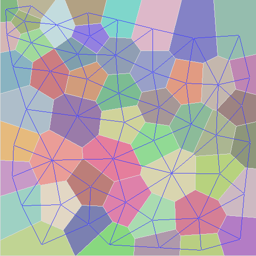

[](https://travis-ci.org/JCash/voronoi?branch=master)

# jc_voronoi
A fast C implementation for creating 2D Voronoi diagrams from a point set

Uses [Fortune's sweep algorithm.](https://en.wikipedia.org/wiki/Fortune%27s_algorithm)




Brief
=====

I was realizing that the previous 2D voronoi generator I was using, was taking up too much time in my app,
and worse, sometimes it also produced errors.

So I started looking for other implementations.

Given the alternatives out there, they usually lack one aspect or the other.
So this project set out to achieve a combination of the good things the other libs provide.

* Easy to use
* Robustness
* Speed
* Small memory footprint
* Single/Double floating point implementation
* Readable code
* Small code (single source file)
* No external dependencies
* Cells have a list of edges (for easier/faster relaxation)
* Edges should be clipped
* A clear license

But mostly, I did it for fun :)

Disclaimer
==========

This software is supplied "AS IS" without any warranties and support

License
=======

[The MIT license](http://choosealicense.com/licenses/mit/)


Usage
=====

The api is very small

```C
void jcv_diagram_generate( int num_points, const jcv_point* points, int img_width, int img_height, jcv_diagram* diagram );
void jcv_diagram_generate_useralloc( int num_points, const jcv_point* points, int img_width, int img_height, void* userallocctx, FJCVAllocFn allocfn, FJCVFreeFn freefn, jcv_diagram* diagram );
void jcv_diagram_free( jcv_diagram* diagram );

const jcv_site* jcv_diagram_get_sites( const jcv_diagram* diagram );
const jcv_edge* jcv_diagram_get_edges( const jcv_diagram* diagram );
```

Example implementation (see main.c for actual code)
```C

#define JC_VORONOI_IMPLEMENTATION
// If you wish to use doubles
//#define JCV_REAL_TYPE double
//#define JCV_FABS fabs
//#define JCV_ATAN2 atan2
#include "jc_voronoi.h"

void draw_edges(const jcv_diagram* diagram);
void draw_cells(const jcv_diagram* diagram);

void generate_and_draw(int numpoints, const jcv_point* points, int imagewidth, int imageheight)
{
    jcv_diagram diagram;
    memset(&diagram, 0, sizeof(jcv_diagram));
    jcv_diagram_generate(count, points, imagewidth, imageheight, &diagram );

    draw_edges(diagram);
    draw_cells(diagram);

    jcv_diagram_free( &diagram );
}

void draw_edges(const jcv_diagram* diagram)
{
    // If all you need are the edges
    const jcv_edge* edge = jcv_diagram_get_edges( diagram );
    while( edge )
    {
        draw_line(edge->pos[0], edge->pos[1]);
        edge = edge->next;
    }
}

void draw_cells(const jcv_diagram* diagram)
{
    // If you want to draw triangles, or relax the diagram,
    // you can iterate over the sites and get all edges easily
    const jcv_site* sites = jcv_diagram_get_sites( diagram );
    for( int i = 0; i < diagram->numsites; ++i )
    {
        const jcv_site* site = &sites[i];

        const jcv_graphedge* e = site->edges;
        while( e )
        {
            draw_triangle( site->p, e->pos[0], e->pos[1]);
            e = e->next;
        }
    }
}

// Here is a simple example of how to do the relaxations of the cells
void relax_points(const jcv_diagram* diagram, jcv_point* points)
{
    const jcv_site* sites = jcv_diagram_get_sites(diagram);
    for( int i = 0; i < diagram->numsites; ++i )
    {
        const jcv_site* site = &sites[i];
        jcv_point sum = site->p;
        int count = 1;

        const jcv_graphedge* edge = site->edges;

        while( edge )
        {
            sum.x += edge->pos[0].x;
            sum.y += edge->pos[0].y;
            ++count;
            edge = edge->next;
        }

        points[site->index].x = sum.x / count;
        points[site->index].y = sum.y / count;
    }
}

```


Comparisons
===========

| Feature vs Impl        | voronoi++ | boost | fastjet | jcv |
|-----------------------:|-----------|-------|---------|-----|
| Edge clip              |     *     |       |    *    |  *  |
| Generate Edges         |     *     |   *   |    *    |  *  |
| Generate Cells         |     *     |   *   |         |  *  |
| Cell Edges Not Flipped |           |   *   |         |  *  |
| Cell Edges CCW         |           |   *   |         |  *  |
| Easy Relaxation        |           |       |         |  *  |
| Custom Allocator       |           |       |         |  *  |


Some Numbers
------------

*Tests run on a 2.9GHz Core i7 MBP with 8GB ram. Each test ran 20 times, and the average time is presented below*

Timings
-------

| counts | jc_voronoi | fastjet    | boost      | voronoi++   |
|-------:|------------|------------|------------|-------------|
| 3      | 0.0015 ms  | 0.0275 ms  | 0.0652 ms  | 0.0296 ms   |
| 10     | 0.0061 ms  | 0.0113 ms  | 0.0147 ms  | 0.0497 ms   |
| 50     | 0.0490 ms  | 0.0449 ms  | 0.1179 ms  | 0.3452 ms   |
| 100    | 0.0860 ms  | 0.1019 ms  | 0.2047 ms  | 0.9219 ms   |
| 200    | 0.1863 ms  | 0.2037 ms  | 0.4472 ms  | 1.8210 ms   |
| 1000   | 1.0830 ms  | 1.1570 ms  | 2.1010 ms  | 12.1560 ms  |
| 2000   | 2.5610 ms  | 2.2350 ms  | 4.1110 ms  | 26.9570 ms  |
| 5000   | 6.9380 ms  | 5.7130 ms  | 10.2390 ms | 85.1440 ms  |
| 10000  | 16.1190 ms | 11.8410 ms | 22.4820 ms | 205.0000 ms |
| 20000  | 34.8410 ms | 23.7810 ms | 48.4620 ms | 524.0000 ms |

Memory
------

| counts | jc_voronoi | fastjet | boost    | voronoi++ |
|-------:|------------|---------|----------|-----------|
| 3      | 16 kb      | 1 kb    | 1 kb     | 1 kb      |
| 10     | 16 kb      | 4 kb    | 7 kb     | 8 kb      |
| 50     | 33 kb      | 21 kb   | 44 kb    | 53 kb     |
| 100    | 50 kb      | 40 kb   | 89 kb    | 110 kb    |
| 200    | 99 kb      | 78 kb   | 180 kb   | 226 kb    |
| 1000   | 432 kb     | 373 kb  | 888 kb   | 1130 kb   |
| 2000   | 864 kb     | 735 kb  | 1779 kb  | 2269 kb   |
| 5000   | 2144 kb    | 1818 kb | 4698 kb  | 5676 kb   |
| 10000  | 4271 kb    | 3611 kb | 9383 kb  | 11334 kb  |
| 20000  | 8541 kb    | 7179 kb | 18775 kb | 22652 kb  |

# Allocations
-------------

| counts | jc_voronoi | fastjet | boost  | voronoi++ |
|-------:|------------|---------|--------|-----------|
| 3      | 1          | 22      | 11     | 36        |
| 10     | 1          | 61      | 43     | 177       |
| 50     | 2          | 214     | 264    | 1015      |
| 100    | 3          | 383     | 536    | 2077      |
| 200    | 6          | 720     | 1073   | 4224      |
| 1000   | 26         | 3263    | 5524   | 21362     |
| 2000   | 52         | 6367    | 11073  | 42854     |
| 5000   | 129        | 15584   | 27872  | 107426    |
| 10000  | 257        | 30811   | 55797  | 214427    |
| 20000  | 514        | 61102   | 111734 | 428530    |

Same numbers, as images

Timings


Memory Usage


Number of Allocations


General thoughts
================

Fastjet
-------

The Fastjet version is built upon Steven Fortune's original C version, which Shane O'Sullivan improved upon. 
Given the robustness and speed improvements of the implementation done by Fastjet,
that should be the base line to compare other implementations with.

Unfortunately, the code is not very readable, and the license is unclear (GPL?)

Also, if you want access to the actual cells, you have to recreate that yourself using the edges.


Boost
-----

Using boost might be convenient for some, but the sheer amount of code is too great in many cases.
I had to install 5 modules of boost to compile (config, core, mpl, preprocessor and polygon).

It is ~2x as slow as the fastest algorithms, and takes ~2.5x as much memory.

The boost implementation also puts the burden of clipping the final edges on the client.

The code consists of only templated headers, and it increases compile time a *lot*.
For simply generating a 2D voronoi diagram using points as input, it is clearly overkill.


Voronoi++
---------

The performance of it is very slow (~20x slower than fastjet) and 
And it uses ~2.5x-3x more memory than the fastest algorithms.

Using the same data sets as the other algorithms, it breaks under some conditions.


O'Sullivan
----------

A C++ version of the original C version from Steven Fortune.

Although fast, it's not completely robust and will produce errors.
