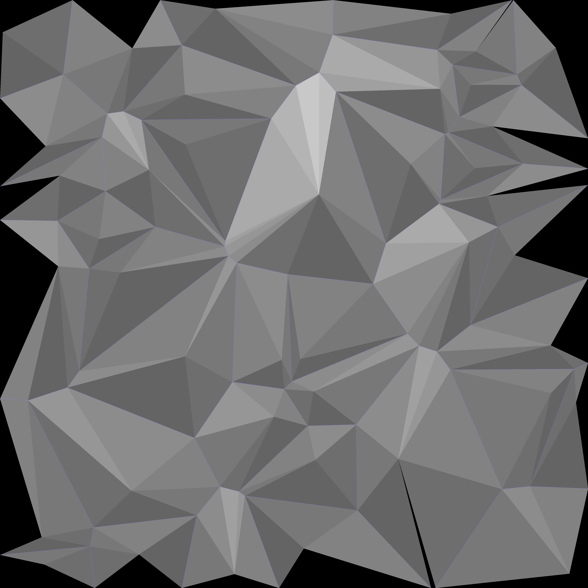

# Some comparisons between implementations

* Same input data
* 10 and 40 sites respectively
* Some implementations doesn't provide a cell's edges (hence they're black)
* Some implementations doesn't give you enough info to cover the entire area.

# jc_voronoi
_
 

# boost
_
 

# voronoi++
_
 

# fastjet
It looks black, but it actually contains the edges and sites
 

# osullivan
It looks black, but it actually contains the edges and sites
 

