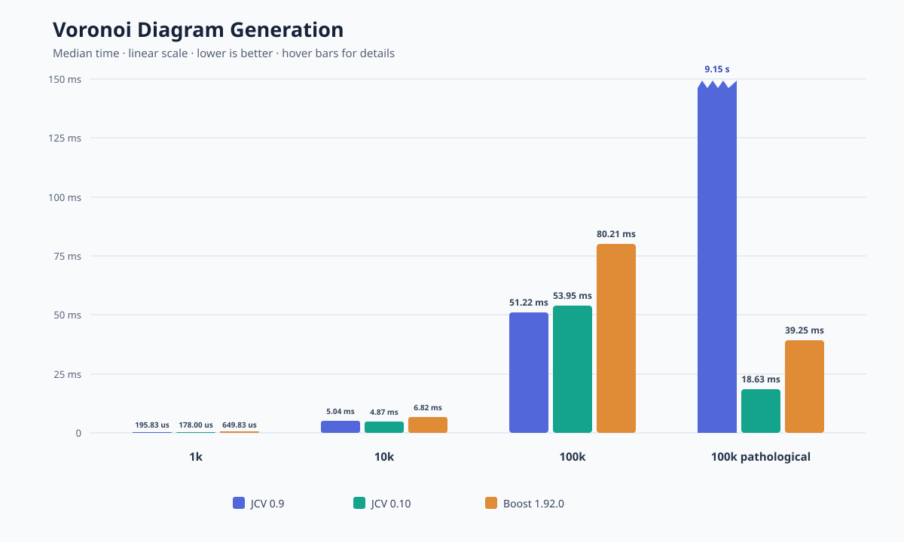
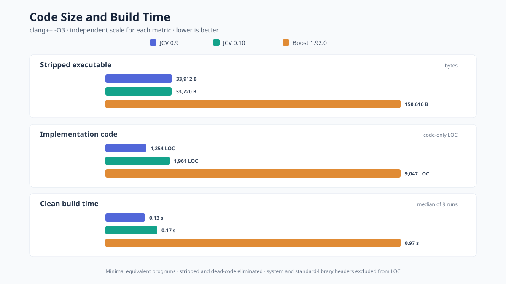

# 0.10.0 performance

This compares jc_voronoi (JCV) 0.9, the JCV 0.10 release candidate with the
specialized site sort and priority queue, and Boost.Polygon from Boost 1.92.0.
Lower is better throughout.

## Highlights

- 0.10.0 generates the 100k pathological case about 491x faster than 0.9.0 and is 52.5% faster
  than Boost.
- At 100k random sites, 0.10.0 finishes in 53.95 ms and is 32.7% faster than
  Boost.
- At 100k, 0.10.0 retains 26.0 MiB: 27.4% less than Boost. Its peak is 40.5
  MiB, 1.6% less than Boost.
- On regular random inputs, 0.9.0 remains faster; 0.10.0 targets pathological
  robustness and reduces retained memory substantially.

## Voronoi Diagram Generation

Times are medians. The regular cases use deterministic random sites with seed
4. The 100k pathological case is the existing `issue48` dataset with 99,998
symmetric diagonal-pair sites.

| Case | 0.9 | 0.10 | Boost | 0.10/Boost |
|---|---:|---:|---:|---:|
| 1k | 195.83 us | 178.00 us | 649.83 us | 27.4% |
| 10k | 5.04 ms | 4.87 ms | 6.82 ms | 71.5% |
| 100k | 51.22 ms | 53.95 ms | 80.21 ms | 67.3% |
| 100k pathological | 9.15 s | 18.63 ms | 39.25 ms | 47.5% |

The chart uses a linear 0–150 ms time axis. The jagged JCV 0.9.0 pathological
bar is truncated because its measured time is 9.15 seconds.

### Beachline optimization

An isolated comparison around the red-black-tree commit confirms that its
benefit is input-dependent. At 100k random sites, the version immediately
before the tree takes 51.79 ms and the tree commit takes 58.43 ms. The old
linked scan starts at `last_inserted`, which is usually a good local hint for
this input; tree comparisons, rotations, and maintenance add overhead.

For the pathological case, the old hint degenerates: JCV 0.9.0 takes 9.15
seconds, while the initial Red-Black tree takes 22.70 ms and current RAVL-based
0.10.0 took 19.43 ms before the specialized site sort and priority queue. Those
optimizations reduce the current result further to 18.63 ms. The tree therefore
provides roughly the expected 491x improvement where the linked scan exhibits
its bad behavior.

## Memory

Each entry is `peak heap / retained heap / allocation count`. Peak is the
maximum live heap during construction. Retained is the live diagram heap when
generation returns, before the diagram is freed. Harness timing-storage bytes
are excluded. Allocation count is per generation.

| Case | 0.9 | 0.10 | Boost | 0.10/Boost |
|---|---:|---:|---:|---:|
| 1k | 511,364 B / 511,364 B / 30 | 459,400 B / 288,408 B / 18 | 441,872 B / 376,000 B / 5,542 | 104.0% |
| 10k | 4,947,748 B / 4,947,748 B / 281 | 4,281,712 B / 2,763,352 B / 126 | 4,499,280 B / 3,760,000 B / 55,815 | 95.2% |
| 100k | 49,213,284 B / 49,213,284 B / 2,785 | 42,428,620 B / 27,305,708 B / 1,187 | 43,114,912 B / 37,600,000 B / 557,371 | 98.4% |
| 100k pathological | 47,345,436 B / 47,345,436 B / 2,671 | 46,558,092 B / 36,137,276 B / 2,041 | 59,390,968 B / 37,599,248 B / 400,010 | 78.4% |

`0.10/Boost` compares peak bytes. The memory chart draws retained memory as
the darker lower portion of each peak-memory bar.

## Code and build statistics

This uses minimal equivalent programs that generate a three-site diagram,
compiled and linked with `clang++ -O3 -DNDEBUG -Wl,-dead_strip`. Executables
are stripped. Lower is better.

| Metric | JCV 0.9 | JCV 0.10 | Boost 1.92.0 | JCV 0.10/Boost |
|---|---:|---:|---:|---:|
| Stripped executable | 33,912 B | 33,720 B | 150,616 B | 22.4% |
| Implementation code | 1,254 LOC | 1,961 LOC | 9,047 LOC | 21.7% |
| Clean build time | 0.13 s | 0.17 s | 0.97 s | 17.5% |

Build time is the median of nine interleaved compile-and-link runs. LOC is
code-only output from `cloc`, excluding comments and blank lines. For JCV this
is its single implementation header. For Boost it is the 34 Boost headers
transitively included by the minimal Voronoi program; standard-library and
platform headers are excluded.

The 0.10.0 minimal executable is 4.5x smaller than Boost, includes 4.6x fewer
implementation lines, and builds 5.7x faster on this machine.

## Method

- Apple M5 Max MacBook Pro, 128 GB RAM, arm64 macOS.
- Apple clang 21.0.0, `-O3 -DNDEBUG`, C++11 benchmark harness.
- JCV 0.10 uses the working tree after the specialized sort and priority-queue
  optimizations.
- Random cases use seed 4. It avoids a seed-dependent bug in 0.9.0 that affects
  some 100k inputs; all versions use the same generated points.
- 0.10 is the median of five benchmark-batch medians. Each batch uses 201
  iterations for 1k, 51 for 10k, and 31 for 100k and the pathological case.
  Boost uses 21 iterations.
- 0.9 uses 21 iterations for 1k and 10k, and 5 iterations for the pathological
  case because each generation takes about nine seconds.
- Input setup, image/output generation, and output allocation are outside the
  timed region; diagram destruction is included. Memory covers diagram
  generation and records retained bytes immediately before destruction.
